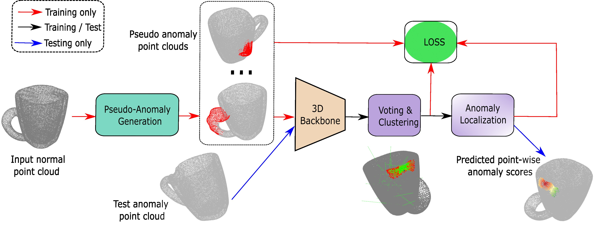

## Point Cloud Anomaly Detection with Varied Defect Synthesis and Vote-Based Clustering



## Download

+ To download the Anomaly-ShapeNet dataset: click [here](https://huggingface.co/datasets/Chopper233/Anomaly-ShapeNet)

+ For the newly collected dataset: click [here](https://drive.google.com/file/d/1ceazjhGExMzI48fJOv4gV-bPESyvOokf/view?usp=drive_link).

### Data preparation
   ```bash
   $ python newly_gt.py
   $ python newly_multi_gt.py
   ```

### Checkpoint preparation

| Backbone          | Pretrain Method                                                                                                                                                                 |
| ----------------- | ------------------------------------------------------------------------------------------------------------------------------------------------------------------------------- |
| Point Transformer | [Point-MAE](https://github.com/Pang-Yatian/Point-MAE/releases/download/main/pretrain.pth)                                                                                       |

- Download checkpoints and move them into `./checkpoints/`

### Detailed training and testing instructions will be released once the paper is published.

